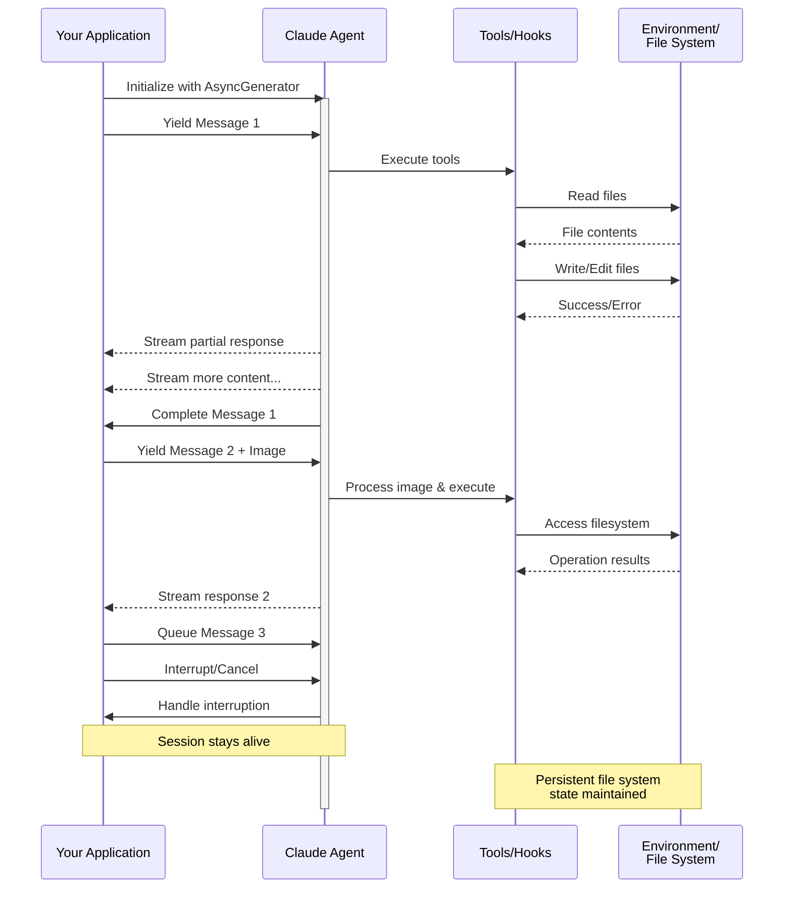

# Streaming Input

Comprensión de los dos modos de entrada del Claude Agent SDK y cuándo usar cada uno

---

## Descripción General

El Claude Agent SDK admite dos modos de entrada distintos para interactuar con los agentes:

- **Streaming Input Mode** (Por defecto y recomendado) - Una sesión interactiva y persistente
- **Single Message Input** - Consultas de un solo disparo que usan estado de sesión y reanudación

Esta guía explica las diferencias, beneficios y casos de uso de cada modo para ayudarte a elegir el enfoque correcto para tu aplicación.

## Streaming Input Mode (Recomendado)

El modo de entrada por streaming es la forma **preferida** de usar el Claude Agent SDK. Proporciona acceso completo a las capacidades del agente y habilita experiencias interactivas enriquecidas.

Permite que el agente opere como un proceso de larga duración que recibe entrada del usuario, gestiona interrupciones, expone solicitudes de permisos y administra el estado de la sesión.

### Cómo Funciona



### Beneficios

- **Image Uploads** — Adjunta imágenes directamente a los mensajes para análisis y comprensión visual
- **Queued Messages** — Envía múltiples mensajes que se procesan secuencialmente, con capacidad de interrupción
- **Tool Integration** — Acceso completo a todas las herramientas y servidores MCP personalizados durante la sesión
- **Hooks Support** — Usa lifecycle hooks para personalizar el comportamiento en distintos puntos
- **Real-time Feedback** — Ve las respuestas a medida que se generan, no solo los resultados finales
- **Context Persistence** — Mantén el contexto de la conversación a través de múltiples turnos de forma natural

### Ejemplo de Implementación

**TypeScript**
```typescript
import { query } from "@anthropic-ai/claude-agent-sdk";
import { readFile } from "fs/promises";

async function* generateMessages() {
  // First message
  yield {
    type: "user" as const,
    message: {
      role: "user" as const,
      content: "Analyze this codebase for security issues"
    }
  };

  // Wait for conditions or user input
  await new Promise((resolve) => setTimeout(resolve, 2000));

  // Follow-up with image
  yield {
    type: "user" as const,
    message: {
      role: "user" as const,
      content: [
        {
          type: "text",
          text: "Review this architecture diagram"
        },
        {
          type: "image",
          source: {
            type: "base64",
            media_type: "image/png",
            data: await readFile("diagram.png", "base64")
          }
        }
      ]
    }
  };
}

// Process streaming responses
for await (const message of query({
  prompt: generateMessages(),
  options: {
    maxTurns: 10,
    allowedTools: ["Read", "Grep"]
  }
})) {
  if (message.type === "result") {
    console.log(message.result);
  }
}
```

**Python**
```python
from claude_agent_sdk import (
    ClaudeSDKClient,
    ClaudeAgentOptions,
    AssistantMessage,
    TextBlock,
)
import asyncio
import base64


async def streaming_analysis():
    async def message_generator():
        # First message
        yield {
            "type": "user",
            "message": {
                "role": "user",
                "content": "Analyze this codebase for security issues",
            },
        }

        # Wait for conditions
        await asyncio.sleep(2)

        # Follow-up with image
        with open("diagram.png", "rb") as f:
            image_data = base64.b64encode(f.read()).decode()

        yield {
            "type": "user",
            "message": {
                "role": "user",
                "content": [
                    {"type": "text", "text": "Review this architecture diagram"},
                    {
                        "type": "image",
                        "source": {
                            "type": "base64",
                            "media_type": "image/png",
                            "data": image_data,
                        },
                    },
                ],
            },
        }

    # Use ClaudeSDKClient for streaming input
    options = ClaudeAgentOptions(max_turns=10, allowed_tools=["Read", "Grep"])

    async with ClaudeSDKClient(options) as client:
        # Send streaming input
        await client.query(message_generator())

        # Process responses
        async for message in client.receive_response():
            if isinstance(message, AssistantMessage):
                for block in message.content:
                    if isinstance(block, TextBlock):
                        print(block.text)


asyncio.run(streaming_analysis())
```

## Single Message Input

El modo de entrada de mensaje único es más simple pero también más limitado.

### Cuándo Usar Single Message Input

Usa el modo de mensaje único cuando:

- Necesitas una respuesta de un solo disparo
- No necesitas adjuntar imágenes, hooks, etc.
- Necesitas operar en un entorno sin estado, como una función lambda

### Limitaciones

> **Advertencia:** El modo Single Message Input **no** admite:
> - Adjuntar imágenes directamente en los mensajes
> - Cola dinámica de mensajes
> - Interrupción en tiempo real
> - Integración de hooks
> - Conversaciones multi-turno naturales

### Ejemplo de Implementación

**TypeScript**
```typescript
import { query } from "@anthropic-ai/claude-agent-sdk";

// Simple one-shot query
for await (const message of query({
  prompt: "Explain the authentication flow",
  options: {
    maxTurns: 1,
    allowedTools: ["Read", "Grep"]
  }
})) {
  if (message.type === "result") {
    console.log(message.result);
  }
}

// Continue conversation with session management
for await (const message of query({
  prompt: "Now explain the authorization process",
  options: {
    continue: true,
    maxTurns: 1
  }
})) {
  if (message.type === "result") {
    console.log(message.result);
  }
}
```

**Python**
```python
from claude_agent_sdk import query, ClaudeAgentOptions, ResultMessage
import asyncio


async def single_message_example():
    # Simple one-shot query using query() function
    async for message in query(
        prompt="Explain the authentication flow",
        options=ClaudeAgentOptions(max_turns=1, allowed_tools=["Read", "Grep"]),
    ):
        if isinstance(message, ResultMessage):
            print(message.result)

    # Continue conversation with session management
    async for message in query(
        prompt="Now explain the authorization process",
        options=ClaudeAgentOptions(continue_conversation=True, max_turns=1),
    ):
        if isinstance(message, ResultMessage):
            print(message.result)


asyncio.run(single_message_example())
```
